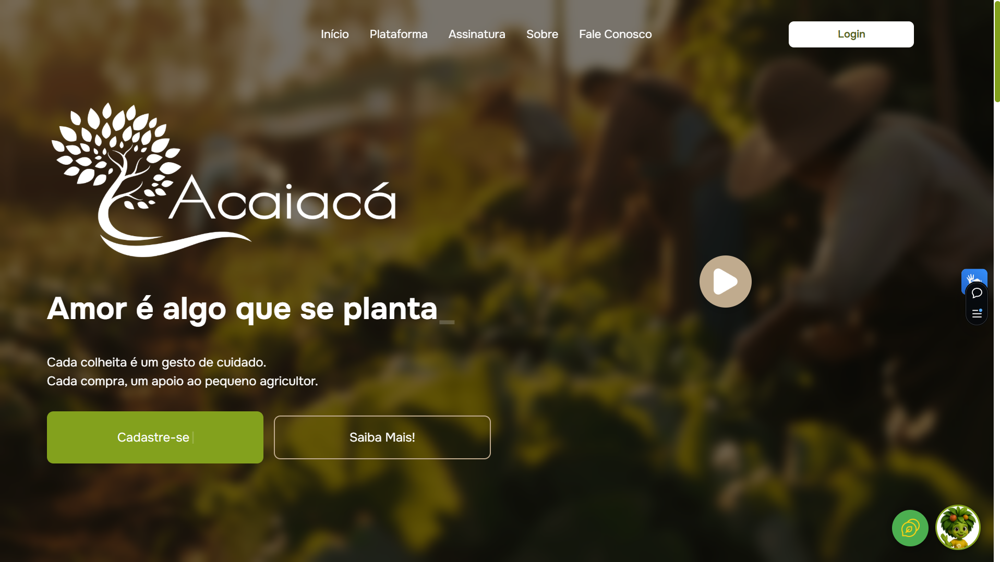

# Acaiacá 🍏

A Acaiacá é uma plataforma que conecta pequenos agricultores diretamente aos consumidores, valorizando a produção local e promovendo relações mais humanas, justas e conscientes no acesso aos alimentos.

---

## 💻 Plataforma

Acesse a plataforma online: https://plataforma-acaiaca.vercel.app/



---

## 🚀 Tecnologias Utilizadas

- [ ] HTML5
- [ ] Chakra
- [ ] JavaScript
- [ ] React 
- [ ] Axios 
- [ ] Vite 

---

## 📦 Instalação e Uso

Siga os passos abaixo para executar o projeto localmente:

```bash
# 1. Clone o repositório
git clone https://github.com/[seu-usuario]/[nome-do-projeto].git

# 2. Acesse a pasta do projeto
cd [nome-do-projeto]

# 3. Instale as dependências
npm install

# 4. Inicie o servidor de desenvolvimento
npm run dev

